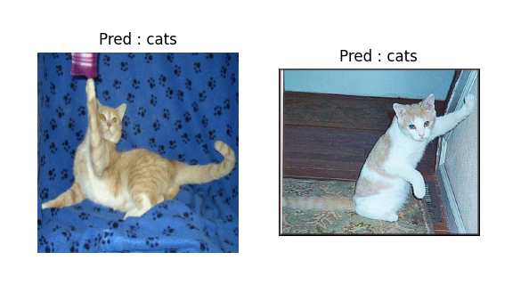
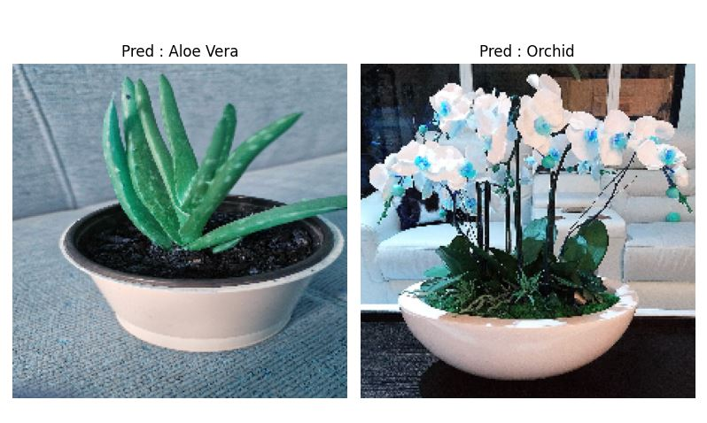

# Computer Vision Project

These are some mini projects that I made using Pytorch for computer vision assignments

#### Repo Update
- **17 Sep 2024 -> plant-species-classification**
- **16 Sep 2024 -> cat-and-dogs-classification**

### Dont have CUDA for Training ? Download Model Here

| Model Name         | Model URL                                                                |
| ----------------- | ------------------------------------------------------------------ |
| Cat and Dogs | [click here to download](https://drive.google.com/file/d/1Tfh30c0BShuSTTpvgeCYBHK2aZdkhjV0/view?usp=drive_link) |
| Plant Species | [click here to download](https://drive.google.com/file/d/1OYLj2TIK2oTglLJMRt2t7BW2tGLM6178/view?usp=drive_link) |

## cat-and-dogs-classification (Created : 16-09-2024)

in this project, I focused on fine-tune the resnet-50 model then exported it to onnx format.

which initially resnet-50 outputs approximately 1000 classes into just 2 classes according to the dataset that has been downloaded, namely cats and dogs

- Loss : 0.06402150790199812
- Accuracy : 98.46762234305487%
- Epochs : 5

## plant-species-classification (Created : 17-09-2024)

in this project, I focused on fine-tune the google/vit-base-patch16-224 model then exported it to onnx format.

which initially google/vit-base-patch16-224 outputs approximately 1000 classes into just 47 classes according to the dataset that has been downloaded, namely house-plant-species

- Loss : 0.305279920695395
- Accuracy : 93.55418434246046%
- Epochs : 5

#### Todo List 
- ~~Fine Tune Resnet-50 with cats and dogs dataset (2 class)~~ :white_check_mark:
- ~~Fine Tune google/vit-base-patch16-224 with house plant species dataset (47 class)~~ :white_check_mark:
- Fine Tune Faster-RCNN with face mask dataset (3 class) :x:
- Fine Tune YOLOV10 with manga text detection dataset (2 class) :x:

## Authors

- [@naufalahnaf17](https://www.github.com/naufalahnaf17)
