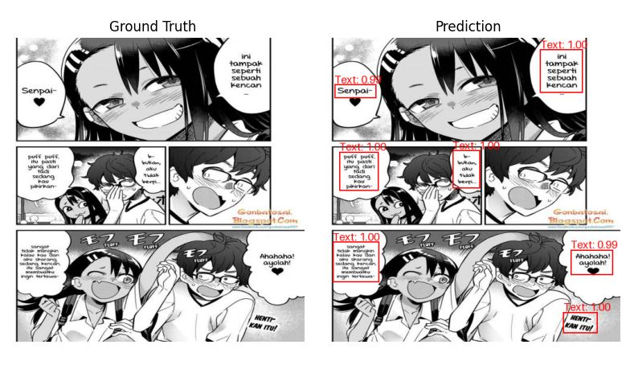
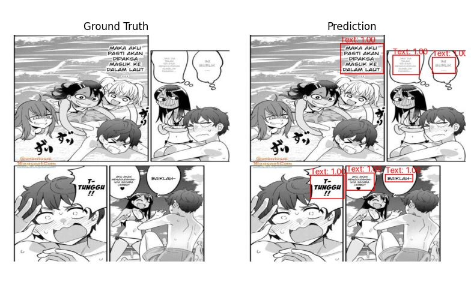

# Computer Vision Project

These are some mini projects I created using Pytorch for computer vision tasks

in this repo I will create a mini project with various tasks in computer vision such as image classification, object detection, object segmentation, GAN and many more

add a star to get updates from this repo

#### Repo Update
- **26 Sep 2024 -> inference next js plant-species-classification**
- **25 Sep 2024 -> inference next js cat-and-dogs-classification**
- **20 Sep 2024 -> facemask-detection**
- **17 Sep 2024 -> manga-text-detection**
- **17 Sep 2024 -> plant-species-classification**
- **16 Sep 2024 -> cat-and-dogs-classification**

### Dont have CUDA for Training ? Download Model Here

| Model Name         | Model URL                                                                |
| ----------------- | ------------------------------------------------------------------ |
| Cat and Dogs | [click here to download](https://drive.google.com/file/d/1Tfh30c0BShuSTTpvgeCYBHK2aZdkhjV0/view?usp=drive_link) |
| Plant Species | [click here to download](https://drive.google.com/file/d/1OYLj2TIK2oTglLJMRt2t7BW2tGLM6178/view?usp=drive_link) |
| Manga Text | [click here to download](https://drive.google.com/file/d/1kI_RXo2hoQ9fQWU3CcB1wrw3-CFOfKe4/view?usp=drive_link) |
| Facemask Detection | [click here to download](https://drive.google.com/file/d/1J2AKUaLGDlDAXvZCgUNtsz-Hhyqw7EVv/view?usp=drive_link) |

## cat-and-dogs-classification (Created : 16-09-2024)

in this project, I focused on fine-tune the resnet-50 model then exported it to onnx format.

which initially resnet-50 outputs approximately 1000 classes into just 2 classes according to the dataset that has been downloaded, namely cats and dogs

- Loss : 0.06402150790199812
- Accuracy : 98.46762234305487%
- Epochs : 5

## plant-species-classification (Created : 17-09-2024)

in this project, I focused on fine-tune the google/vit-base-patch16-224 model then exported it to onnx format.

which initially google/vit-base-patch16-224 outputs approximately 1000 classes into just 47 classes according to the dataset that has been downloaded, namely house-plant-species

- Loss : 0.305279920695395
- Accuracy : 93.55418434246046%
- Epochs : 5

## manga-text-detection (Created : 17-09-2024)

in this project, I focused on fine-tune the faster-RCNN model then exported it to onnx format.

create object detection on text in manga pages with the manga-text-detection dataset

- Loss : 0.105800
- Epochs : 25
- MAP : 0.9
- MAP-50 : 1.0
- MAP-75 : 0.9901

## facemask-detection (Created : 20-09-2024)

in this project, I focused on fine-tune the YOLOv10 model then exported it to onnx format.

create object detection on facemask-dataset

- Loss : 0.405800
- Epochs : 50
- MAP : 0.908
- MAP-50 : 0.934
- MAP-75 : 0.666

## Todo List 
- [x] Fine tune resnet-50 on the cats and dogs dataset
  - [x] Create inference with opencv and onnxruntime (python)
  - [x] Create inference with next.js and onnxruntime-web
  - [ ] Create Inference with kotlin
- [x] Fine tune vit-base-224 on the plant species dataset
  - [x] Create inference with opencv and onnxruntime (python)
  - [x] Create inference with next.js and onnxruntime-web
  - [ ] Create Inference with kotlin
- [x] Fine tune Faster-RCNN on the manga text detection dataset
  - [x] Create inference with opencv and onnxruntime (python)
  - [ ] Create inference with next.js and onnxruntime-web
- [x] Fine tune YOLO-V10 on the facemask dataset
  - [x] Create inference with opencv and onnxruntime (python)
  - [ ] Create inference with next.js and onnxruntime-web
  - [ ] Create Inference with kotlin and run with input uint8

## Authors

- [@naufalahnaf17](https://www.github.com/naufalahnaf17)
