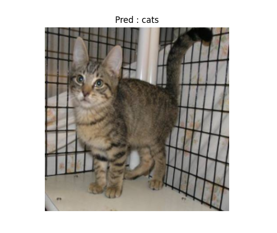

# Computer Vision Classification: Cats and Dogs

## Overview

This project focuses on **computer vision** classification using a dataset of cats and dogs. The main goal is to build and fine-tune a deep learning model to classify images into two categories: cats and dogs. The dataset used for this task contains images of cats and dogs in various environments and poses.

## Screenshot

## Project Structure

- **datasets.py**: Scripts and methods for downloading, unzipping, preparing the dataset and Image preprocessing techniques to ensure that images are in the correct format and size for the model.
- **training.py**: Code for training a deep learning model on the dataset.
- **main.py**: Code for running inference on test images using the trained model.

## Dataset

The dataset used in this project is the [Cats and Dogs dataset](https://www.kaggle.com/datasets/tongpython/cat-and-dog) from Kaggle. It contains labeled images of cats and dogs, which are used for training and testing the classification model.

### Dataset Structure

- `training_set/`: Folder containing training images of cats and dogs.
- `test_set/`: Folder containing test images for model evaluation.

## Installation

To run this project, ensure you have the following dependencies installed:
Install the required packages using `pip`:

    pip install requirements.txt

Training Model 

    python train.py

Inference Model Trained (make sure training is complete so model auto save with model name "cats-and-dogs.onnx")

    python main.py

Creator : Naufal Ahnaf