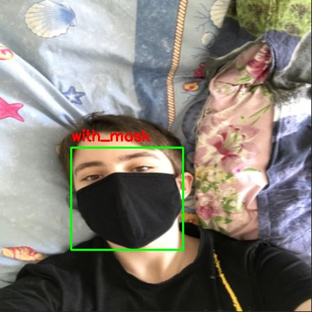
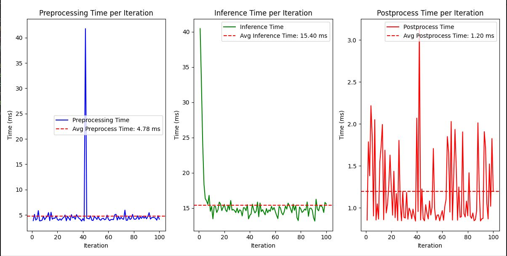

# Computer Vision Classification: Facemask-Detection

## Overview

This project focuses on **computer vision** object detection using a dataset of Facemask-dataset. The main goal is to build and fine-tune a deep learning model to detect images into three categories: with_mask,without_mask,mask_wear_incorect. The dataset used for this task contains images of Facemask-Detection in various environments and poses.

## Screenshot

## Project Structure

- **datasets.py**: Scripts and methods for downloading, and preprocess to format yolo
- **training.py**: Code for fine-tune a deep learning model on the dataset.
- **main.py**: Code for running inference on test images using the trained model.
- **benchmark.py.py**: Benchmark performance YOLO.

## Dataset

The dataset used in this project is the [Facemask-Detection dataset](kaggle datasets download -d andrewmvd/face-mask-detection) from Kaggle. It contains labeled images of Facemask-Detection, which are used for training and testing the detection model.

### Dataset Structure

- `facemask-dataset/`: Folder containing training and labels images and labels in format YOLO.
- `data/`: Folder containing training and labels images and labels in format VOC.

## Installation

To run this project, ensure you have the following dependencies installed:
Install the required packages using `pip`:

    pip install -r requirements.txt

Fine-Tune Model 

    python train.py

Inference Model Trained (make sure training is complete so model auto save with model name "best.onnx")

    python main.py

Creator : Naufal Ahnaf