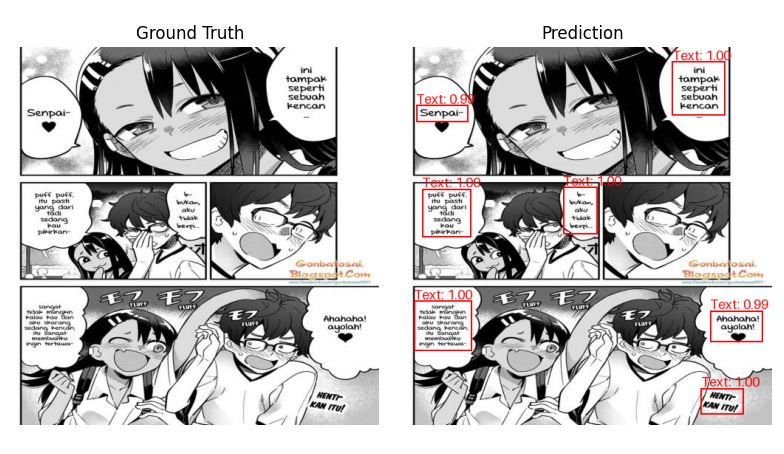
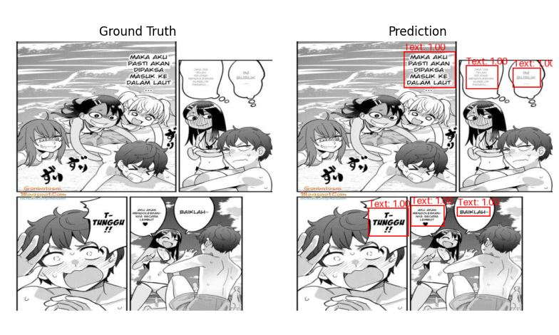

# Computer Vision Classification: Manga Text Detection

## Overview

This project focuses on **computer vision** classification using a dataset of manga-text-detection. The main goal is to build and fine-tune a deep learning model to detect text on single image 512x512. The dataset used for this task contains images of manga page and annotations.json in COCO format.

## Screenshot

## Project Structure

- **datasets.py**: Scripts and methods for downloading, unzipping, preparing the dataset and Image preprocessing techniques to ensure that images are in the correct format and size for the model.
- **training.py**: Code for training a deep learning model on the dataset.
- **main.py**: Code for running inference on test images using the trained model.

## Dataset

The dataset used in this project is the [Manga Text Detection](https://www.kaggle.com/datasets/naufalahnaf17/manga-text-detection) from Kaggle (creator : Myself). It contains annotations and images of manga, which are used for training and testing the object detection model.

### Dataset Structure

- `train/`: list images and contain 1 single fine _annotations.coco.json
- `test/`: list images and contain 1 single fine _annotations.coco.json
- `valid/`: list images and contain 1 single fine _annotations.coco.json

## Installation

To run this project, ensure you have the following dependencies installed:
Install the required packages using `pip`:

    pip install -r requirements.txt

Training Model 

    python train.py

Inference Model Trained (make sure training is complete so model auto save with model name "manga-text-detection.onnx")

    python main.py

Creator : Naufal Ahnaf