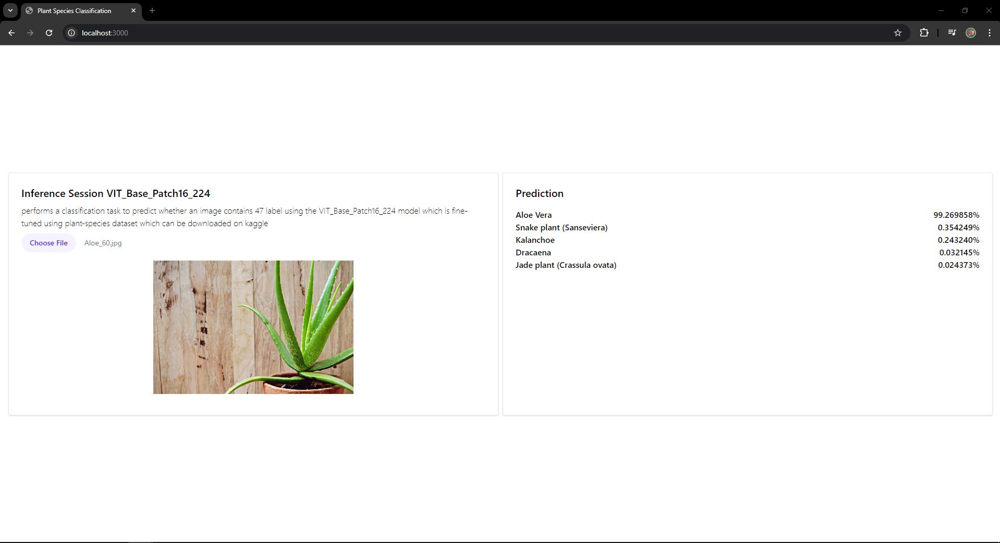

# Computer Vision Classification: Plant Species Classification

## Overview

This project focuses on **computer vision** classification using a dataset of house-plant-species. The main goal is to build and fine-tune a deep learning model to classify images into 47 categories. The dataset used for this task contains images of plants in various environments and poses.

## Screenshot

## Project Structure

- **datasets.py**: Scripts and methods for downloading, unzipping, preparing the dataset and Image preprocessing techniques to ensure that images are in the correct format and size for the model.
- **training.py**: Code for training a deep learning model on the dataset.
- **main.py**: Code for running inference on test images using the trained model.
- **web** : Next JS for Inference

## Dataset

The dataset used in this project is the [House Plant Species](https://www.kaggle.com/datasets/kacpergregorowicz/house-plant-species) from Kaggle. It contains labeled images of plants, which are used for training and testing the classification model.

### Dataset Structure

- `house_plant_species/`: Folder root.
- `name_plant_xxxx/`: Folder names is actually label and contain list thousand images

## Installation

To run this project, ensure you have the following dependencies installed:
Install the required packages using `pip`:

    pip install -r requirements.txt

Training Model 

    python train.py

Inference Model Trained (make sure training is complete so model auto save with model name "plant-classification.onnx")

    python main.py

## Next.JS Installation

Move to web folder

    cd web

Create 'public' folder and copy model onnx to public, then run this command

    npm install

Run in dev mode

    npx next dev

Open in localhost:3000

Creator : Naufal Ahnaf